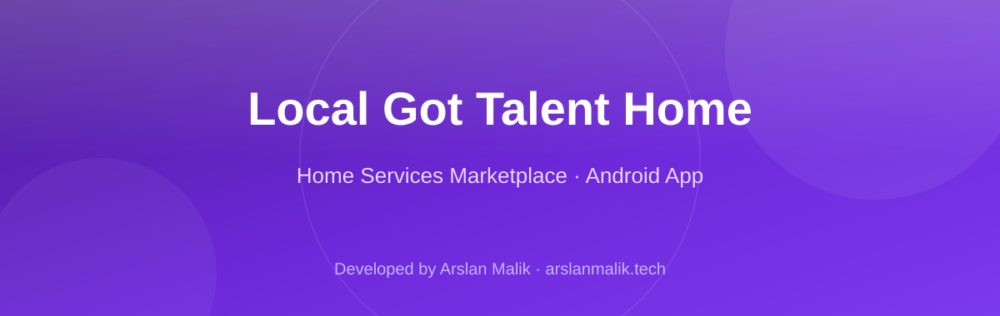
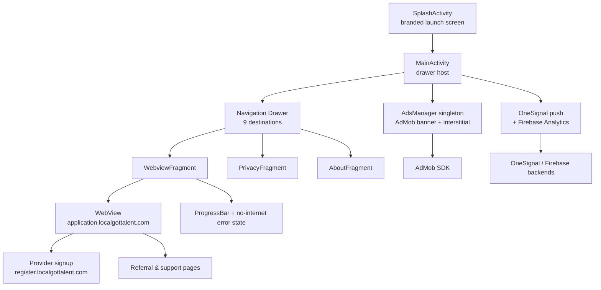

<p align="center">
  
</p>

<p align="center">
  
  
  
  
</p>

> **Developed by [Arslan Malik](https://github.com/arsalanmaalik461)**
> 📱 WhatsApp: [+92 300 8987448](https://wa.me/923008987448) · 🌐 Website: [arslanmalik.tech](https://arslanmalik.tech)

---

## 🌟 Executive Overview

**Local Got Talent Home** (`com.app.localgottalent1`) is the Android companion app for the *Local Got Talent* home-services marketplace — a platform that connects households with skilled, professional local workers: electricians, plumbers/handymen, HVAC (AC maintenance) technicians, housekeeping staff, masons, carpenters, tutors, beauticians, tailors, home cooks, artists, graphic designers and more. It is also a channel for skilled workers themselves to sign up and earn: customers can join, refer others, and even become service providers straight from the app.

Technically the app is a native Android (Java) shell built around an embedded `WebView` that renders the live marketplace web app (`application.localgottalent.com`), wrapped with a branded splash screen, a navigation drawer with nine destinations, a loading progress bar, an offline/no-internet state, and full AdMob monetization (banner + interstitial via a singleton `AdsManager`), OneSignal push notifications, and Firebase Analytics. At version 99 with `minSdk 19`, it is clearly a shipped, Play-Store-tested build — not a prototype.

---

## 📑 Table of Contents

- [✨ Key Features & Highlights](#-key-features--highlights)
- [🖥️ Feature Showcase](#️-feature-showcase)
- [🏗️ System Architecture](#️-system-architecture)
- [🚀 Quickstart & Installation Guide](#-quickstart--installation-guide)
- [📂 Project Structure](#-project-structure)
- [🛡️ Security & Notes](#️-security--notes)

---

## ✨ Key Features & Highlights

| Feature | Description |
| :--- | :--- |
| 🏠 Marketplace WebView shell | Full-screen `WebView` loading `application.localgottalent.com` — the live home-services platform |
| 🧭 Navigation drawer | Nine destinations: Home, LGT Contact Us, LGT Referral, Become A Provider, Rate App, Share App, Privacy Policy, About Us, Exit |
| 👷 Provider onboarding path | Dedicated drawer link to `register.localgottalent.com` so skilled workers can sign up to earn |
| 🤝 Customer referral flow | In-app referral link (`/customer-referral`) with the platform's Rs. 500 signup incentive messaging |
| ⏳ Branded splash screen | `SplashActivity` launch flow before the main experience |
| 📶 Offline / error state | `no_internet.png` artwork and `onReceivedError` handling when the WebView can't load |
| 💰 AdMob monetization | Singleton `AdsManager` with small-banner and interstitial units, plus an `isAdsEnabled` kill-switch flag |
| 🔔 Push notifications | OneSignal Android SDK 4.8.1 wired into the app |
| 📊 Analytics | Firebase Analytics integrated via `google-services` plugin |
| 🔒 Privacy & About fragments | Dedicated in-app Privacy Policy and About Us screens |
| 🌐 JavaScript-enabled browsing | WebView with JS enabled and internal URL handling |
| 📦 Broad device support | `minSdk 19` with MultiDex, AppCompat + Material Design UI |

---

## 🖥️ Feature Showcase

### 1. The Marketplace Shell

> "Local Got Talent is a platform where we connect different communities with our Skilled and Professional Workers for their Home Service."

- Full-screen `WebviewFragment` loads the live marketplace at `application.localgottalent.com`, with JavaScript enabled for the modern web app.
- Loading progress bar keeps the user oriented while pages render; a dedicated no-internet screen appears on load failure.
- Internal links stay inside the app via `shouldOverrideUrlLoading` instead of kicking out to a browser.

### 2. Navigation Drawer — Customer & Provider Journeys

> "Become A Provider" · "LGT Referral" · "LGT Contact Us"

- Drawer sections route customers to Home, referral, and support pages, and route skilled workers to the provider registration site.
- The Communicate group bundles Rate App, Share App (viral growth), Privacy Policy, and About Us — all reachable without leaving the app.

### 3. Monetization & Engagement Stack

> Banner ads, interstitials, push notifications, analytics — a complete mobile business loop.

- `AdsManager` singleton serves AdMob banner and interstitial units; interstitial frequency is governed by `SHOW_INTER_ON_CLICKS` and can be switched off globally with `Config.isAdsEnabled`.
- OneSignal (app ID in `Config.java`) drives push re-engagement; Firebase Analytics tracks usage.
- `AD_ID` permission declared for advertising identifier compliance.

---

## 🏗️ System Architecture



---

## 🚀 Quickstart & Installation Guide

### Prerequisites

- **Android Studio** (Hedgehog or newer — AGP 8.0.0 requires **JDK 17**)
- **Android SDK 33** (compile/target), build tools via SDK Manager
- A test device or emulator (API 19+; `minSdk 19`, MultiDex enabled)
- Your own AdMob app/ad-unit IDs, OneSignal app ID, and web URLs if rebranding

### Step-by-Step Installation

```bash
# 1. Clone the repository
git clone https://github.com/arsalanmaalik461/Local-Got-Talent-Home-Service.git
cd Local-Got-Talent-Home-Service

# 2. Open the project in Android Studio (let Gradle sync; AGP 8.0.0, Gradle wrapper included)

# 3. (Rebranding) Point the app at your own site in app/src/main/res/values/strings.xml:
#      web_link_home      -> your site URL
#      web_link_item4     -> your provider-registration URL
#      admob_app_id       -> your AdMob app ID

# 4. (Rebranding) Update app/src/main/java/com/app/localgottalent1/utils/Config.java:
#      ADMOB_SMALL_BANNER_AD_ID / ADMOB_INTER_AD_ID -> your ad unit IDs
#      ONESIGNAL_APP_ID                           -> your OneSignal app ID
#      Set isAdsEnabled = false to disable ads entirely

# 5. Add your google-services.json (Firebase) to the app/ module for Analytics

# 6. Build & run on a device/emulator
./gradlew assembleDebug
# APK: app/build/outputs/apk/debug/app-debug.apk
```

> The shipped build in this repo is `versionCode 99` / `versionName "99"` targeting SDK 33 — bump `versionCode`/`versionName` in `app/build.gradle` before your own release.

---

## 📂 Project Structure

```
Local-Got-Talent-Home-Service/
├── README.md
├── docs/
│   └── assets/
│       └── banner.svg
├── app/
│   ├── build.gradle                    # com.app.localgottalent1 · v99 · SDK 33 · minSdk 19
│   ├── proguard-rules.pro
│   └── src/main/
│       ├── AndroidManifest.xml         # INTERNET, AD_ID perms · AdMob meta-data
│       ├── java/com/app/localgottalent1/
│       │   ├── activity/
│       │   │   ├── SplashActivity.java # Launch splash flow
│       │   │   ├── MainActivity.java    # Drawer host + app shell
│       │   │   └── MyApplication.java   # Application class
│       │   ├── fragments/
│       │   │   ├── WebviewFragment.java # Marketplace WebView (progress + error states)
│       │   │   ├── PrivacyFragment.java
│       │   │   └── AboutFragment.java
│       │   └── utils/
│       │       ├── Config.java          # AdMob/OneSignal IDs, ad kill-switch
│       │       └── AdsManager.java      # Banner + interstitial singleton
│       └── res/
│           ├── values/strings.xml       # Web URLs, AdMob app ID, about-us copy
│           ├── layout/                  # activity_main/splash, fragment_webview/privacy/about, nav drawer
│           ├── menu/nav_items.xml       # 9 drawer destinations
│           └── drawable/ + mipmap-*/    # Icons, splash art, no-internet artwork
├── build.gradle                        # AGP 8.0.0 · google-services · OneSignal plugin
├── settings.gradle                     # :app module (project name 'AndroLite')
├── gradle.properties
├── gradlew / gradlew.bat
└── gradle/
```

---

## 🛡️ Security & Notes

- **Baked-in third-party IDs:** The AdMob app ID (`ca-app-pub-9141146483717028~2791668266`), ad unit IDs, and OneSignal app ID in `Config.java` / `strings.xml` belong to the original publisher — replace them with your own before any public build, and never publish your production `google-services.json` blindly.
- **Client contact info in-app:** The About fragment ships the original operator's details (Red Sun IT Services · support@localgottalent.com · +92 334 0099852). Update `strings.xml` (`about_us_*`) when rebranding.
- **Cleartext traffic:** `android:usesCleartextTraffic="true"` is set in the manifest — keep it only if the loaded web endpoints genuinely need plain HTTP; prefer HTTPS.
- **Ads permission:** `com.google.android.gms.permission.AD_ID` is declared for AdMob; ensure Play Console ad-ID declarations match your build.
- **Min SDK 19 + Jetifier:** legacy-support + Jetifier are enabled for the broad device range; turning on R8/minify in `buildTypes` is recommended for release size and obfuscation.

---

<p align="center">
  <sub>Developed with ❤️ by <a href="https://github.com/arsalanmaalik461">Arslan Malik</a> · 📱 <a href="https://wa.me/923008987448">WhatsApp: +92 300 8987448</a> · 🌐 <a href="https://arslanmalik.tech">arslanmalik.tech</a></sub>
</p>
